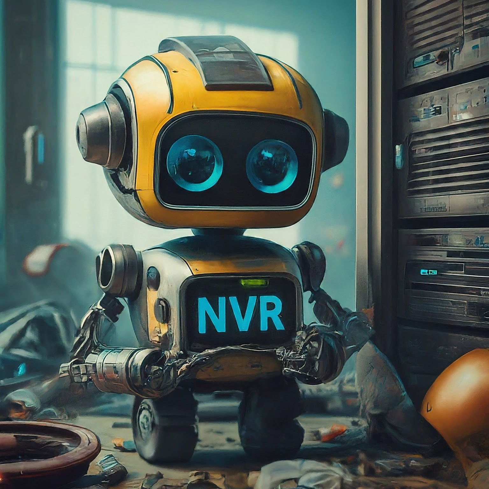

# NVR-System

  

## Project Description:
> The NVR-System is a comprehensive video surveillance solution built on a containerized architecture. It leverages AI-powered object detection, robust security practices, and user-friendly management tools. This system provides high-definition video recording, real-time analysis, and secure remote access for effective surveillance and monitoring.

## Key Features:
* AI-powered object detection and classification
* Secure multi-factor authentication
* User-friendly web interface for system management
* Integration with home automation systems
* Scalable architecture for future growth
* Containerized deployment for flexibility and efficiency
* Robust security measures for data protection

## Server Specifications:

| Component             | Specification                               |
|-----------------------|---------------------------------------------|
| Processor             | Intel Core i5-13600k                        |
| Memory                | 16GB DDR4                                   |
| Storage               | (3x)                                        |
| - 1TB                 | SSD (OS)                                    |
| - 4TB                 | NVME (Video Storage)                        |
| - 12TB                | HDD (Video Archive Storage)                 |
| Graphics Card         | Nvidia RTX 3050 (for AI Object Detection)   |
| Operating System      | Ubuntu (Headless) Server 24.04 LTS          |

## Application List:

**Security and Authentication**
* Google oAuth (Multi-factor authentication)
* Crowdsec (Intrusion detection and prevention)

**Reverse Proxy**
* Traefik (Manages incoming traffic)

**Monitoring and Management**
* Portainer (Container management)
* Homepage Dashboard (User interface)
* IT Tools (Administrative tools)
* Dozzle (Container logging and monitoring)

**Smart Integration**
* Mosquitto MQTT Broker (Communication protocol)
* Home Assistant (Automation platform)

**NVR Core**
* Frigate NVR
* TensorFlow AI Object Detection

## Author Information:

* **Name**: Ryan Morris
* **Business**: G33K Doctors
* **Web**: https://www.g33kdoctors.com
* **Social**: https://www.facebook.com/G33KMD

### Boring Stuff
Copyright: 2024, G33K Doctors
License: MIT (See 'LICENSE' file for details)
