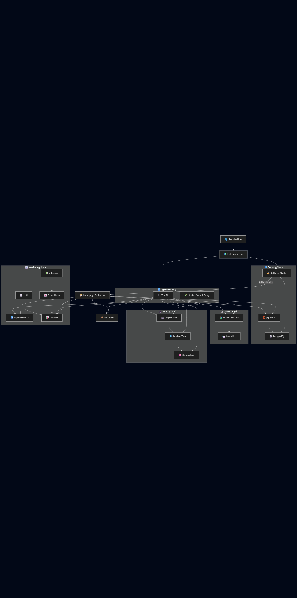

# Project Name: NVR-System

> Self-hosted, AI-powered video surveillance with secure access and smart automation integration.

  

## Project Description

> The NVR-System is a comprehensive video surveillance solution built on a containerized architecture. It leverages AI-powered object detection, robust security practices, and user-friendly management tools. This system provides high quality video recording, real-time analysis, and secure remote access for effective surveillance and monitoring.

## Server Specifications

| Component             | Specification                               |
|-----------------------|---------------------------------------------|
| Processor             | Intel Core i5-12600k                        |
| Memory                | 16GB DDR4                                   |
| Storage               | (3x)                                        |
| - 1TB                 | sda (OS)                                    |
|   - User Home         | sda2 (/home)                                |
|   - Docker App        | sda3 (/docker)                              |
|   - OS Installation   | sda4 (/)                                    |
| - 12TB                | HDD (Video Archive Storage)                 |
|   - Archived Footage  | sdb1 (/videos/archives)                     |
| - 4TB                 | NVME (Video Storage)                        |
|   - Recent Footage    | sda4 (/video/current)                       |
| GPU                   | Nvidia RTX 3050 (for video processing)      |
| TPU         | M.2 PCIe Google Coral EdgeTPU (AI Object Detection)   |
| Operating System      | Ubuntu (Headless) Server 24.04 LTS          |

## Key Features

AI-powered object detection and classification
Secure multi-factor authentication
User-friendly web interface for system management
Integration with "smart" automation systems
Scalable architecture for future growth
Containerized deployment for flexibility and efficiency
Robust security measures for data protection

## Deployment Overview

The system uses Docker Compose to orchestrate all containers, with Traefik routing incoming requests to internal services based on domain rules. Authentication is enforced via Authelia for all public-facing endpoints. Logs and metrics are gathered using Prometheus and Loki, visualized through Grafana. Object detection is handled by Frigate with optional facial recognition via Compreface and Double-Take. All configurations are stored in version-controlled volumes for easy restoration.

## Application List

**Security and Authentication**
Authelia – Multi-factor authentication for securing services
pgAdmin – PostgreSQL administration GUI
PostgreSQL – Centralized database powering Authelia, Grafana, Frigate, Home Assistant, and other services

**Reverse Proxy and Access Control**
Traefik – Smart reverse proxy managing HTTPS (with automatic SSL/TLS certificate management), routing, and middlewares
Docker Socket-Proxy (Wollomatic) – Secure, read-only proxy to the Docker Socket

**Monitoring and Logging**
Grafana – Visualization dashboard for logs, metrics, and system health
Prometheus – Time-series database for metrics collection
Grafana Loki – Log aggregation system (used alongside Prometheus/Grafana)
cAdvisor – Real-time container resource usage and performance stats
Uptime-Kuma – Fancy self-hosted status page and uptime monitor

**Container Management**
Portainer-CE – Docker container and stack management UI

**Smart Home and Automation**
Home Assistant – Core automation and integration platform for "smart" devices
Mosquitto MQTT Broker – Lightweight message broker for IoT devices

**NVR System and AI Recognition**
Frigate NVR – AI-powered object detection and recording for IP cameras
Compreface – Facial recognition engine for identifying known individuals
Double-Take – "Middle Man" for connecting Frigate snapshots with Compreface for face matching

**Dashboards and User Interfaces**
Homepage Dashboard – Customizable landing page with service status and links

**Mermaid Diagram**
User path when accessing the system.

## Security Notes

* All services are behind a reverse proxy and require authentication via Authelia.
* External access is limited to secured endpoints using HTTPS with valid SSL certificates.
* Sensitive services (e.g., PostgreSQL, Docker Socket) are only accessible internally.
* Services use non-root users (UID 1001) with least-privilege access, when possible.

## Author Information

* **Name**: Ryan Morris
* **Business**: G33K Doctors
* **Web**: https://www.g33kdoctors.com
* **Social**: https://www.facebook.com/G33KMD

## Standard Information

Copyright: 2025, G33K Doctors
License: MIT (See 'LICENSE' file for details)
